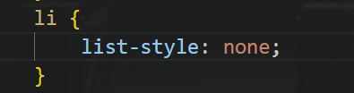
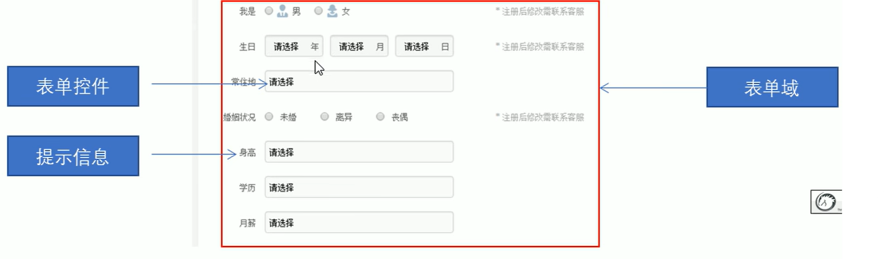
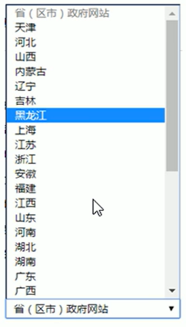
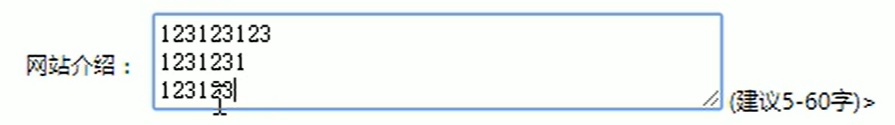
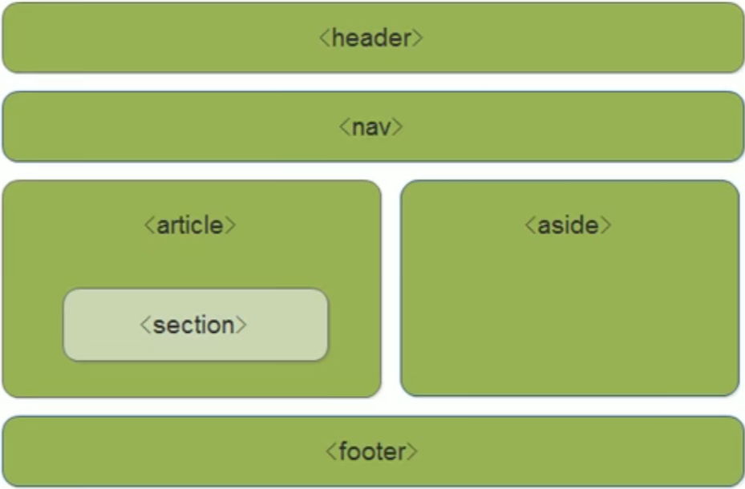

# HTML

## 网页

1. 什么是网页？

​ **网站**是指在因特网上根据一定的规则，使用 HTML 等制作的用于展示特定内容相关的**网页合集**。

**网页**是网站其中的一“页”，通常是`HTML`格式的文件，他要通过浏览器来阅读

**网页**是构成**网站**的**基本元素**，它通常由图片、链接、文字、声音、视频等**元素**组成。

我们看到的网页，常见以`.html`或`.htm`后缀结尾的文件存在，因此将其俗称为`HTML文件`。

2. 什么是 HTML？

`HTML`指的是**超文本标记语言（`Hyper Text Markup Language`）**，他是用来描述网页的一种语言。

`HTML`不是一种编程语言，而是一种标记语言（markup language）。

标记语言是一套标记标签（markup tag）

- 超文本
  - 可以加入图片、声音、动画、多媒体等内容（超越了文本限制）
  - 还可以从一个文件跳转到另一个文件，与世界各地的主机链接（超级链接文本）

3. 网页的形成

​ 网页是由**网页元素**组成的，这些元素是利用`HTML`标签描述出来，然后通过浏览器解析来显示给用户的。

网页是图片、链接、文字、声音、视频等元素组成，其实就是一个`HTML`文件。

网页是由前端人员书写`HTML`文件，经过浏览器解析之后显示的。

## Web 标准

`Web`标准是 W3C 组织和其他标准化组织制定的一系列标准的集合。W3C（万维网联盟）是国际最著名的标准化组织。

1. **为什么需要 Web 标准？**

   I. 浏览器不同，他们显示页面或者排版就会有些许差异

   II. 让 Web 的发展前景更广阔。

   III. 内容能被更广泛的设备访问

   IV. 更容易被搜索引擎搜索

   V. 降低网站流量费用

   VI. 使网站更容易维护

   VII. 提高页面浏览速度

2. **Web 标准的构成**

   主要包括==结构（Structrue）==、==表现（Presentation）==和==行为（Behavior）==三个方面。

   | 标准 |                                   说明                                   |
   | :--: | :----------------------------------------------------------------------: |
   | 结构 |       结构用于对**网页元素**进行整理和分类，现阶段主要学的是`HTML`       |
   | 表现 |  表现用于设置网页元素的版式、颜色、大小等**外观样式**，主要指的是`CSS`   |
   | 行为 | 行为是指**网页模型的定义**及**交互**的编写，现阶段主要学的是`Javascript` |

   Web 标准提出的最佳体验方案：==结构、表现、行为相分离==。

   简单理解为：**结构写到`HTML`文件中，表现写到`CSS`文件中，行为写到`JavaScript`文件中**。

## 标签

### 一.（1）：基本语法概述

1. `HTML`标签是**由尖括号包围的关键词**，例如：`<html>`。
2. `HTML`标签*通常*是**成对**出现的，例如：`<html>`和`<HTML>`，我们称之为**双标签**。标签对中的第一个标签是**开始标签**，第二个是**结束标签**。 1. 有些特殊的标签必须是单个标签（极少），例如：`<br/>`,我们称之为**单标签**。

### 一.（2）：标签关系

双标签关系可以分为两类：**包含关系**和**并列关系**

1. 包含关系

   ```html
   <head>
   	<title></title>
   </head>
   ```

2. 并列关系

   ```html
   <head></head>
   <body></body>
   ```

### 二.（1）：HTML 基本结构标签

每个页面都会有一个基本的结构标签（也称为骨架标签），页面上的内容也是在这些基本标签上书写。

| 标签名           | 定义       | 说明                                                   |
| ---------------- | ---------- | ------------------------------------------------------ |
| `<html> <HTML>` | HTML 标签  | 页面中最大的标签，我们称之为**根标签**                 |
| `<head> </head>` | 文档的头部 | 在 head 标签中，我们必须要设置的标签是`title`          |
| `<body> </body>` | 文档的主体 | 元素包含文档的所有内容，页面内容基本都是放到`body`里面 |

我们利用`VSCode`可以快速创建以下内容

```html
<!DOCTYPE html>
<html lang="en">
	<head>
		<meta charset="UTF-8" />
		<meta http-equiv="X-UA-Compatible" content="IE=edge" />
		<meta name="viewport" content="width=device-width, initial-scale=1.0" />
		<title>Document</title>
	</head>
	<body></body>
<HTML>
```

### 二.（2）：s 其他标签

1. **文档类型声明标签**
   `<!DOCTYPE>`文档类型声明，作用就是告诉浏览器使用哪种`HTML`版式来显示网页

   `<!DOCTYPE html>`意为：当前页面应采用最新的`HTML5`版式来显示网页

   **PS：**

   ​ I. `<!DOCTYPE>`声明位于文档中的最前面的位置,处于`<html>`标签之前。
   ​ II. `<!DOCTYPE>`不是一个`HTML`标签，只是一个文档类型声明标签。

2. **`lang`语言种类**

   用来定义当前文档显示的语言。

   I. `en`定义语言为**英语**

   II. `zh-CN`定义语言为中文

   其实对于文档显示来说，定义成`en`的文档也可以显示中文，相应的，定义为`zh-CN`的文档也可以显示英文。

   3. **字符集**

      字符集（Character set）是多个字符的集合。以便计算机能够识别和存储各种文字。

      在`<head>`标签内，可以通过`<meta>`标签的`charset`属性来规定 HTML 文档应该使用哪种字符编码。

      `charset`常用的值有：**GB2312**、**BIG5**、**GBK**和**UTF-8**，其中，**UTF-8**也被称为==万国码==，基本包含了全世界所有国家需要用到的字符。

### 二.（2）：常用标签

#### 1：**标题标签（h1-h6）**

`HTML`提供了 6 个等级的标题标签，即`<h1>~<h6>`。

```html
<h1>我是一级标题</h1>
```

h 是 head 的缩写，意为头部、标题。

语义：**作为标题使用，并且依据重要性递减**。

特点:

- 加了标题便签的文字会被加粗，字号也会变大
- 一个标题独占一行

#### 2：**段落标签**

`<p>`标签用于定义段落，他可以将整个网页分为若干个段落。

```html
<p>我是一个段落标签</p>
```

p 是 paragraph 的缩写，意为段落。

语义：**可以把 HTML 文档分割为若干段落**。

特点：

- 文本在一个段落中会根据浏览器窗口的大小自动换行 (自适应性)
- 段落和段落之间保有一定的空隙

#### 3：**换行标签**

​ `<br />`如果需要某段文字强制换行显示，就需要用到换行标签

​ $br$ 是单词 break 的缩写，意为打断、换行。

​ 特点：

- `<br />`是一个单标签

- `<br />`只是简单的开始新的一行，与段落不一样，段落之间会插入一些垂直距离

#### 4：文本格式化标签

- 在网页中，有时需要为文字设置**粗体**、_斜体_、~~删除线~~或<u>下划线</u>效果，这时就需要用到`HTML`中的文本格式化标签，使文字以特殊的方式显示。

|  语义  |              标签              |               说明                |
| :----: | :----------------------------: | :-------------------------------: |
|  加粗  | `<strong></strong>`or`<b></b>` | 更推荐使用`<strong></strong>`标签 |
|  倾斜  |     `<em></em>`or`<i></i>`     |     更推荐使用`<em></em>`标签     |
| 删除线 |    `<del></del>`or`<s><s>`     |    更推荐使用`<del></del>`标签    |
| 下划线 |    `<ins></ins>`or`<u></u>`    |    更推荐使用`<ins></ins>`标签    |

#### 5：div & span 标签

- `<div>`与·`<span>`是没有语义的，它们就是一个**盒子**，用来装内容的。

  ```html
  <div>盒子1</div>
  <span>盒子2</span>
  ```

  - $div$ 是 $division$ 的缩写，表示分割、分区。
  - $span$ 意为跨度、跨距。

- **PS:**

  - `<div>`标签用来布局，但是一行只能放一个`<div>`,`<div>`单独占一行，是一个大盒子。
  - `<span>`标签用来布局，可以将多个内容放在一行，但内容之间留有间距，是一个小盒子。

#### 6：图像标签&路径

##### 图像标签

在 $HTML$ 标签中，``标签用来定义 HTML 页面中的图像。

```html

```

这是一个**单标签**

$img$ 是 $image$ 的缩写，意为图像

`src`是``标签的**必须属性**，它用于指定**图像文件的路径和文件名**。

``标签的属性：

|   属性   |  属性值  |                    说明                    |
| :------: | :------: | :----------------------------------------: |
|  `src`   | 图片路径 |                  必须属性                  |
|  `alt`   |   文本   | 替换文本。图像不能显示时，所显示的提示文字 |
| `title`  |   文本   |   提示文本。鼠标移动到图片上方显示的文字   |
| `width`  |   像素   |                设置图像宽度                |
| `height` |   像素   |                设置图像高度                |
| `border` |   像素   |              设置图像边框粗细              |

- 图像标签可以拥有多个属性，必须写在标签名的后面。
- 一般`width`与`height`只修改一个，另一个会等比例缩放
- 属性之间不分先后顺序，标签名与属性、属性与属性之间均以空格分开。
- 属性采用键值对的格式，即 `key = "key_value"`的格式，`属性 = "属性值"`。

##### 路径

路径可以分为**相对路径**&**绝对路径**

- 相对路径

  以**引用文件所在位置**为参考基础，而建立的目录路径。

| 相对路径分类 | 符号 | 说明                                                           |
| ------------ | ---- | -------------------------------------------------------------- |
| 同级目录     |      | 图像与引用文件处于同一级 如：``            |
| 下级目录     | /    | 图像文件处于引用文件的下一级 如：`` |
| 上级目录     | ../  | 图像文件处于引用文件的上一级 如：``     |

- 绝对路径

  是指目录下的绝对位置，直接到达目标位置，通常是从盘符开始的。

  如："`D:\PROJECT\SIMS\SIMS\resource\images\bk.jpg`"

#### 7：超链接标签

在 HTML 标签中，`<a>`标签用于定义超链接，作用是从一个页面链接到另一个页面

- 超链接的语法格式

  ```html
  <a href="跳转目标" target="目标窗口的弹出方式">文本or图像</a>
  ```

  ​ $a$ 是单词 $anchor$ 的首字母，意为：锚。

属性如下：

| 属性     | 作用                                                                                                      |
| -------- | --------------------------------------------------------------------------------------------------------- |
| `href`   | 用于指明链接目标的 URL 地址，（必须属性）当标签应用`href`属性时，她就具有了超链接功能                     |
| `target` | 用于指定链接页面的打开方式，其中`_self`为默认值，以当前窗口打开新页面，`_blank`为在新窗口中打开的打开方式 |

- 链接分类

  - **外部链接**

    如：`<a href="http://www.baidu.com">百度</a>`。

  - **内部链接**

    网站内部页面之间的相互链接，我们称之为内部链接。

    直接链接内部页面名称即可，如：`<a href="idex.html">首页</a>`。

  - **空链接**

    当没有确定链接目标时，用`#`填充`URL`即可

    如：`<a href="#">首页</a>`

  - **下载链接**

    如果`href`里面的地址是一个文件或者压缩包，则点击后会下载这个文件或者压缩包。

  - **网页元素链接**

    在网页中的各种网页元素，如：文本、图像、表格、音频、视频等都可以添加超链接

  - **锚点链接**

    当我们点击链接时，可以**_快速定位到_**页面中的某个位置。

    - 在链接文本的`href`属性中，设置属性值为`#名字`的形式，如`<a href="#three">闪电侠第三季</a>`

    - 找到目标位置标签，在里面添加一个`id`属性，如：`<h3 id="three">第三季介绍</h3> `

#### 8：注释

如果需要在 HTML 文档中添加一些便于阅读和理解但又不需要在页面中的注释文字，就需要用到注释标签。

`<!--注释文本-->`

#### 9：特殊字符

在 HTML 页面中，一些特殊的符号很难或者不方便直接使用，此时我们就可以使用下面的字符来替代。

| 特殊字符 | 描述        | 字符代码   |
| -------- | ----------- | ---------- |
| 'space'  | 空格        | `&nbsp;`   |
| <        | 小于号      | `&lt;`     |
| >        | 大于号      | `&gt;`     |
| &        | 和号        | `&amp;`    |
| ￥       | 人民币      | `&yen;`    |
| ©        | 版权        | `&copy;`   |
| ®        | 注册商标    | `&reh;`    |
| °        | 度          | `&deg;`    |
| ±        | 正负号      | `&plusmn;` |
| ×        | 乘号        | `&times;`  |
| ÷        | 除号        | `&divide;` |
| ²        | 平方/上标 2 | `&sup2;`   |
| ³        | 立方/上标 3 | `%sup3;`   |

#### 10：表格标签

- 表格的主要作用

​ 表格主要用于显示、展示数据，因为它可以让数据显示的非常的规整，可读性非常好。

- 表格的基本语法

  ```html
  <table>
  	<tr>
  		<td>单元格内的文字</td>
  		…………
  	</tr>
  	…………
  </table>
  ```

  - `<table></table>`是用于定义表格的标签
  - `<tr></tr>`标签用于定义表格中的行，必须嵌套在`<table></table>`标签中。
  - `<td></td>`标签用于定义表格中的单元格，必须嵌套在`<tr></tr>`标签中。
    - 字母 td 来自于表格数据（table data）

- 表头单元格标签

  一般表头单元格位于表格的第一列或者第一行，表头单元格里面的文本加粗且居中显示。

  `<th></th>`标签表示 HTML 表格中的表头部分（是为 table head 的缩写）

  ```html
  <table>
  	<tr>
  		<th>姓名</th>
  		…………
  	</tr>
  	…………
  </table>
  ```

- 表格属性

  在实际开发中，由于结构、表现、行为相分离，所以实际上这部分内容不常用，我们一般在 CSS 中实现。

| 属性名        | 属性值                    | 描述                                               |
| ------------- | ------------------------- | -------------------------------------------------- |
| `align`       | `left`、`border`、`right` | 规定表格相对周围元素的对齐方式                     |
| `border`      | `1` or `""`               | 规定表格单元是否拥有边框，默认为`""`，表示没有边框 |
| `cellpanding` | 像素值                    | 规定单元边缘与其内容之间的空白，默认为 1 像素      |
| `cellspacing` | 像素值                    | 规定单元格之间的空白，默认为 2 像素                |
| `width`       | 像素值 or 百分比          | 规定表格的宽度                                     |

#### 11：表格结构标签

- 由于表格可能会很长，为了更好的表示表格的语义，可以将表格分割成表格头部和表格主体两大部分。

- 在表格标签中，分别用：

  - `<thead></thead>`标签 表示表格的**头部**区域 (table head)

    - 其内部必须拥有`<tr></tr>`标签，一般位于第一行

  - `<tbody></thead>`标签 表示表格的**主体**区域 (table body)

    这样可以更好的分清表格结构。

- 以上两个标签都需要被`<table></table>`标签所包裹。

##### 11.1：合并单元格

###### 1.合并单元格的方式

- 跨行合并：`rowspan="合并单元格数量"`
- 跨列合并：`colspan="合并单元格数量"`

###### 2.目标单元格（写合并代码）

- 跨行合并：最上侧单元格作为目标单元格，书写合并代码
- 跨列合并：最左侧单元格作为目标单元格，书写合并代码
- 如：`<td colspan="2"></td>`

#### 12：列表标签

列表标签用于**布局**

根据使用场景的不同，可以分为**无序列表**、**有序列表**、和**自定义列表**。

##### 无序列表

`<ul>`标签表示 HTML 页面中项目的无序列表，一般会以项目符号呈现列表项，而列表项使用`<li>`标签定义。

```html
<ul>
	<li>列表项1</li>
	<li>列表项2</li>
	<li>列表项3</li>
</ul>
```

- 无序列表的各个列表项之间没有顺序级别之分，是并列的。
- `<ul></ul>`中只能嵌套`<li></li>`，直接在`<ul></ul>`标签中输入其他标签或者文字的做法是不被允许的。
- `<li></li>`之间相当于一个容器，可以容纳所有元素。

##### 有序列表

`<ol>`标签用于定义有序列表，列表排序以数字来显示，并且使用`<li>`标签来定义列表项。

```html
<ol>
	<li>列表项1</li>
	<li>列表项2</li>
	<li>列表项3</li>
</ol>
```

- `<ol></ol>`中只能嵌套`<li></li>`，直接在`<ol></ol>`标签中输入其他标签或者文字的做法是不被允许的。

- `<li></li>`之间相当于一个容器，可以容纳所有元素。

- 在 **$CSS$** 中使用`list-style: none;`可以去掉`<li>`标签带来的小圆点

  

##### 自定义列表

自定义列表常用于对术语或者名词进行解释和描述，定义列表的列表项前没有任何项目符号

`<dl>`标签用于定义自定义列表，该标签会于`<dt>`（定义项目/名字）和`<dd>`（描述每一个项目/名字）一起使用

```html
<dl>
	<dt>友情链接</dt>
	<dd>新浪微博</dd>
	<dd>百度贴吧</dd>
</dl>
```

- `<dl>`中只能包含`<dt>`和`<dd>`。
- `<dt>`与`<dd>`个数没有限制，经常是一个`<dt>`对应多个`<dd>`。

#### 13：表单标签

##### 表单的组成

在 HTML 中，一个完整的表单通常由==表单域==、==表单控件（表单元素）==和==提示信息==三个部分构成。



- **表单域**

  表单域就是一个包含表单元素的区域。

  `<form>`标签用于定义表单域，以实现用户信息的收集和传递。

  `<form>`会把它范围内的表单元素信息提交给服务器。

  ```html
  <form action="URL地址" method="提交方式" name="表单域名称">
  	各种表单元素控件
  </form>
  ```

  常用属性：

  |   属性   |    属性值    |                        作用                        |
  | :------: | :----------: | :------------------------------------------------: |
  | `action` |   URL 地址   | 用于指定接收并处理表单数据的服务器程序的 URL 地址  |
  | `method` | `get`/`post` |             用于设置表单数据的提交方式             |
  |  `name`  |     名称     | 用于指定表单的名称，以区分同一个页面中的多个表单域 |

- **表单控件（表单元素）**

  在表单域中可以定义各种表单元素，这些表单元素就是允许用户在表单中输入或者选择的内容控件。

  - `input`输入表单元素

    - 在表单元素中`<input>`标签用于收集用户信息，它是一个单标签

      - 在`<input>`标签中，包含一个`type`属性，更具其不同的属性值，输入字段可以有很多种形式（可以是**文本字段**、**复选框**、**掩码之后的文本控件**、**单选按钮**、**按钮**等）。

        ```html
        <input type="属性值" />
        ```

        `type`属性：

        | 属性值     | 描述                                                             |
        | ---------- | ---------------------------------------------------------------- |
        | `button`   | 定义可点击按钮(多数情况下，用于通过`JavaSript`启动脚本)          |
        | `checkbox` | 定义复选框                                                       |
        | `file`     | 定义输入字段和"浏览"按钮，供文件上传                             |
        | `hidden`   | 定义隐藏的输入字段                                               |
        | `image`    | 定义图像形式的提交按钮                                           |
        | `password` | 定义密码字段，该字段中的字符被掩码                               |
        | `radio`    | 定义单选按钮                                                     |
        | `reset`    | 定义重置按钮，会清除表单中的所有数据                             |
        | `submit`   | 定义提交按钮，会把表单数据发送到服务器                           |
        | `text`     | 定义单行的输入字段，用户可以在其中输入文本，默认宽度是 20 个字符 |

        `<input>`的其他属性

        | 属性        | 属性值       | 描述                                    |
        | ----------- | ------------ | --------------------------------------- |
        | `name`      | 由用户自定义 | 定义 input 元素的名称                   |
        | `value`     | 由用户自定义 | 规定 input 元素的值                     |
        | `checked`   | checked      | 规定此 input 元素在首次加载时应当被选中 |
        | `maxlength` | 正整数       | 规定输入字段中的字符的最大长度          |

        - `name`和`value`是每个表单元素都有的属性值，主要给后台人员使用。
        - `name`表单元素的名字，要求单选按钮和复选框要有相同的`name`值
        - `checked`属性主要针对单选按钮和复选按钮，主要作用是一打开页面，就可以默认选择某个表单元素

  - `select`下拉表单元素

    - 在页面中，如果有多个选项让用户选择，并且想要节约页面空间时，我们可以使用`<select>`标签控件定义**下拉列表**

      

      ```html
      <select>
      	<option>选项1</option>
      	<option>选项2</option>
      	<option>选项3</option>
      </select>
      ```

      - `select`中至少包含一对`<option>`

      - 在`<option>`中定义`select = "selected"`时，当前项即为默认选中项

  - `textarea`文本域元素

    - 当用户输入内容较多的情况下，我们就不能使用文本框表单了，此时我们可以使用`<textarea>`标签

    - 在表单元素中，`<textarea>`标签用于定义多行文本输入的控件

    - 使用多行文本输入控件，可以输入更多的文字，该控件常见用于留言板、评论。

      

      ```html
      <textarea rows="3" cols="20">
          文本内容
      </textarea>
      ```

      - 通过`<textarea>`标签可以轻松地创建多行文本输入框。
      - `cols="每行中的字符数"`，`rows="显示的行数"`。

#### 14：<label>标签

`<label>`标签为 input 元素定义标注（标签）

`<label>`标签用于绑定一个表单元素，当点击`<label>`标签内的文本时，浏览器就会自动将光标转到或选择对应的表单元素上，用来增加用户体验。

语法：

```html
<label for="sex">男</label>
<input type="radio" name="sex" id="sex" />
```

**核心：`<label>`标签的`for`属性应与相关标签的`id`属性相同**。

## $HTML5$ 新特性

​ $HTML5$ 的新增特性主要是针对于以前的不足，增加了一些新的标签、新的表单和新的表单属性等。

### $HTML5$ 新增的语义化标签

​ 以前布局，我们基本用`div`来做。`div`对于搜索引擎来说，是没有语义的。

- `<header>`：头部标签
- `<nav>`：导航标签
- `<article>`：内容标签
- `<section>`：定义文档某个区域
- `<aside>`：侧边栏标签
- `<footer>`：尾部标签



PS：

- 这种语义化标准主要是针对搜索引擎的
- 这种新标签页面中可以使用多次
- 在 IE9 中，需要把这些元素转换为块级元素
- 在移动端更喜欢使用这些标签

### $HTML 5$ 新增的多媒体标签

​ 新增的多媒体标签主要包含两个

1. 音频标签：`<audio>`

   语法：`<audio src="文件地址" controls="controls> </audio>"`

   | 属性       | 值         | 描述                                           |
   | ---------- | ---------- | ---------------------------------------------- |
   | `autoplay` | `autoplay` | 如果出现该属性，则音频在就绪后马上播放         |
   | `controls` | `controls` | 如果出现该属性，则向用户显示控件，比如播放按钮 |
   | `loop`     | `loop`     | 如果出现该属性，则每当音频结束时重新开始播放   |
   | `src`      | `url`      | 要播放的音频的 URL                             |

2. 视频标签：`<video>`

   语法：`<video src="文件地址" controls="controls"> </video>`

| 属性       | 值                                                 | 描述                                                              |
| ---------- | -------------------------------------------------- | ----------------------------------------------------------------- |
| `autoplay` | `autoplay`                                         | 视频就绪播放<br />（谷歌浏览器需要添加`muted`来解决自动播放问题） |
| `controls` | `controls`                                         | 向用户显示播放控件                                                |
| `width`    | `pixels`(像素)                                     | 设置播放器宽度                                                    |
| `height`   | `pixels`(像素)                                     | 设置播放器高度                                                    |
| `loop`     | `loop`                                             | 播放完是否继续播放该视频，循环播放                                |
| `preload`  | `auto`（预先加载视频）<br />`none`（不应加载视频） | 规定是否预加载<br />（如果有了`autoplay`，就忽略该属性）          |
| `src`      | `url`                                              | 视频`url`地址                                                     |
| `poster`   | `imgurl`                                           | 加载等待的画面图片                                                |
| `muted`    | `muted`                                            | 静音播放                                                          |

### $HTML5$ 新增的`input`类型

| 属性值          | 说明                          |
| --------------- | ----------------------------- |
| `type="email"`  | 限制用户输入必须为 Email 类型 |
| `type="url"`    | 限制用户输入必须为 URL 类型   |
| `type="date"`   | 限制用户输入必须为日期类型    |
| `type="time"`   | 限制用户输入必须为时间类型    |
| `type="month"`  | 限制用户输入必须为月类型      |
| `type="week"`   | 限制用户输入必须为周类型      |
| `type="number"` | 限制用户输入必须为数字类型    |
| `type="tel"`    | 手机号码                      |
| `type="search"` | 搜索框                        |
| `type="color"`  | 生成一个颜色选择表单          |

### $HTML5$ 新增的表单属性

| 属性           | 值          | 说明                                                                                                                                                                                                   |
| -------------- | ----------- | ------------------------------------------------------------------------------------------------------------------------------------------------------------------------------------------------------ |
| `required`     | `required`  | 表单拥有该属性表示其内容不能为空，必填。                                                                                                                                                               |
| `placeholder`  | 提示文本    | 表单的提示信息，存在默认值将不显示                                                                                                                                                                     |
| `autofocus`    | `autofocus` | 自动聚焦属性，页面加载完成自动聚焦到指定表单                                                                                                                                                           |
| `autocomplete` | `off/on`    | 当用户在字段开始键入时，浏览器基于之前键入过的值，应该显示出在字段中填写的选项<br />默认已经打开，如`autocomplete="on"`,关闭`autocomplete="off"`<br />需要放在表单内，同时加上`name`属性，同时成功提交 |
| `multiple`     | `mutiple`   | 可以多选文件提交                                                                                                                                                                                       |
